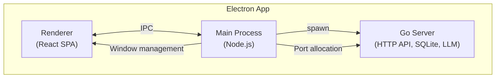

<div align="center">
  
  <h1>Private Buddy</h1>
  <p>
    
  </p>
</div>

A private AI assistant that runs entirely on your machine. Download, install, configure your LLM API key — and you have a fully autonomous agent system with long-term memory, task execution, and knowledge base integration.

This project started as a practice exercise in building a modern agent system from scratch. Along the way, it became a space to explore a question that intrigued me as an engineer: can theories from cognitive science, narratology, and psychology be applied cross-disciplinarily to improve agent design — and can AI itself help validate whether those theories have practical engineering value?

The result is a system whose design choices are grounded in theory rather than convention. The design documents below describe the reasoning behind each subsystem.

---

## What is Different

Most agent frameworks treat all messages uniformly — tool calls, user messages, and assistant replies all go into the same conversation history. Private Buddy takes a different approach across several subsystems.

### Cognitive Order Pipeline

Before an agent responds, a Comprehend → Decide pipeline determines the response strategy: should the agent answer directly (chat), acknowledge and execute (task), or schedule a future action? The pipeline produces a **Guidance** — an execution intent that becomes the task requirement. The cognitive work of understanding intent happens before execution begins.

→ [Agent Interaction Design](doc/agent-interaction-design.md)

### Message Isolation

Tool interactions (bash commands, web searches, file operations) are stored separately from user conversation. The user sees only the request and the delivery — the agent's internal execution process is invisible, just like delegating a task to a colleague. This separation keeps the conversation clean and prevents cognitive overload from irrelevant tool history.

→ [Agent Interaction Design](doc/agent-interaction-design.md)

### Reader-Oriented Notes

LLM calls are stateless — each invocation is a fresh instance with no shared hidden state, like nurses at a shift change. The agent writes notes for a **future reader** (the next LLM instance), not for itself. Notes record *why* decisions were made; the workspace's physical state records *what* happened. A checkpoint mechanism forces periodic note-writing, ensuring continuity even when the agent is deep in a task.

→ [Task Execution & Reader-Oriented Memory](doc/task-execution-and-reader-oriented-memory.md)

### Experience Rather Than Skill

After each task, a reflection pipeline distills transferable principles from the agent's session notes — stripping task-identifying details and host coupling, keeping only the abstract insight. "State the insight, not what was done." These experiences persist as permanent cognitive assets, distinct from the memory system where observations fade with disuse. When reflection identifies a lesson that refines an existing one, it updates rather than appends — the library converges, not just accumulates.

Retrieval uses progressive disclosure: scan a lightweight summary, then recall full content only for relevant entries. This makes retrieval an active agent behavior — the agent decides what to recall — rather than system-driven context insertion. The `when_to_use` field serves as a reverse filter against semantic false positives, helping the agent distinguish "similar but inapplicable" from "different but applicable."

Anthropic's Agent Skills standard lets skills bundle guidance with scripts, assets, and host-specific tool bindings — effective when the package runs in its target environment, but the host-coupled elements don't transfer when the environment changes. Private Buddy's experiences are host-decoupled by design: the reflection pipeline explicitly strips system-specific tools, internal APIs, and configuration, keeping only domain-level knowledge (external APIs, library names, algorithms). Experiences survive host changes — the agent maps each principle to whatever tools the current environment provides, rather than relying on pre-bundled scripts or tool bindings.

### Forgetting-First Memory

The memory system is designed around purposeful forgetting, not indiscriminate preservation. Every observation starts at neutral importance. Only retrieval and use drive importance up; disuse lets it decay. There is no binary gate — importance rises on use and fades continuously, so once-useful but now-obsolete content eventually disappears. A two-layer architecture pairs mechanical observation recording with LLM-driven reflection (EntityProfile), giving the agent both point retrieval and synthesized understanding.

→ [Memory System: Forgetting & Retrieval](doc/memory-system-forgetting-and-retrieval.md)

### Narrative Engineering

The prompt is a narrative, not a form. Background history uses **internal focalization** — addressing the agent as "You" rather than narrating in third person — so the LLM steps into the role instead of observing from the sidelines. A person state inference model (emotion + purpose + situation) runs concurrently within the comprehension phase, producing a single natural-language sentence that guides response strategy without breaking the narrative flow.

→ [Narrative Engineering & User State](doc/narrative-engineering-and-user-state.md)

### Identity-Driven Memory

The agent never encounters the label "Assistant" or "AI" in its own memory records. All evidence labels use real names — the agent's own name and the person's name. This is not cosmetic: when an LLM is told it is "an AI assistant," it activates training patterns associated with sycophancy (agreeing with the user, avoiding disagreement). By using named identities, the agent is positioned as a person with a name who can hold opinions and form independent judgments — producing memory narratives about relationships rather than service logs.

---

## Quick Start

### Desktop Application

Download the latest release for your platform from the [Releases](https://github.com/KoanJan/private-buddy/releases) page. No development environment required.

### Development Mode

Requires Go 1.26+ and Node.js 18+.

```bash
git clone https://github.com/KoanJan/private-buddy.git
cd private-buddy
npm install

# Electron app (recommended for development)
npm run build:server
npm run dev

# Or run server and web separately:
cd server && ./start.sh      # Go backend on :8000
cd web && npm run dev         # Vite dev server on :5173
```

> **Note**: All 0.0.x versions are pre-release. Data compatibility is not guaranteed between versions — upgrading may clear existing user data. This will change once the project reaches 0.1.0.

### Docker

```bash
git clone https://github.com/KoanJan/private-buddy.git
cd private-buddy/docker
docker compose up -d
```

The app will be available at `http://localhost:18888`. Data is persisted in the `docker/data/` directory.

> **Note**: The first build pulls base images and compiles both the frontend and backend, which may take several minutes. Subsequent starts are instant.

---

## Architecture



## Tech Stack

| Layer | Technology |
|-------|------------|
| Frontend | React + TypeScript + Vite + Ant Design |
| Desktop | Electron |
| Backend | Go + Gin + GORM |
| Database | SQLite (pure Go driver) |
| LLM | OpenAI API compatible |

## License

This project is licensed under the GPLv3 License - see the [LICENSE](LICENSE) file for details.
