# Agent Runtime: Event Loop & Work Lifecycle — Engineering Implementation

This document describes how the agent runtime processes incoming events, transitions between Comprehend→Decide→Execute phases, and manages the lifecycle of Work (Chat/Task) that produces agent responses.

## Architecture Overview

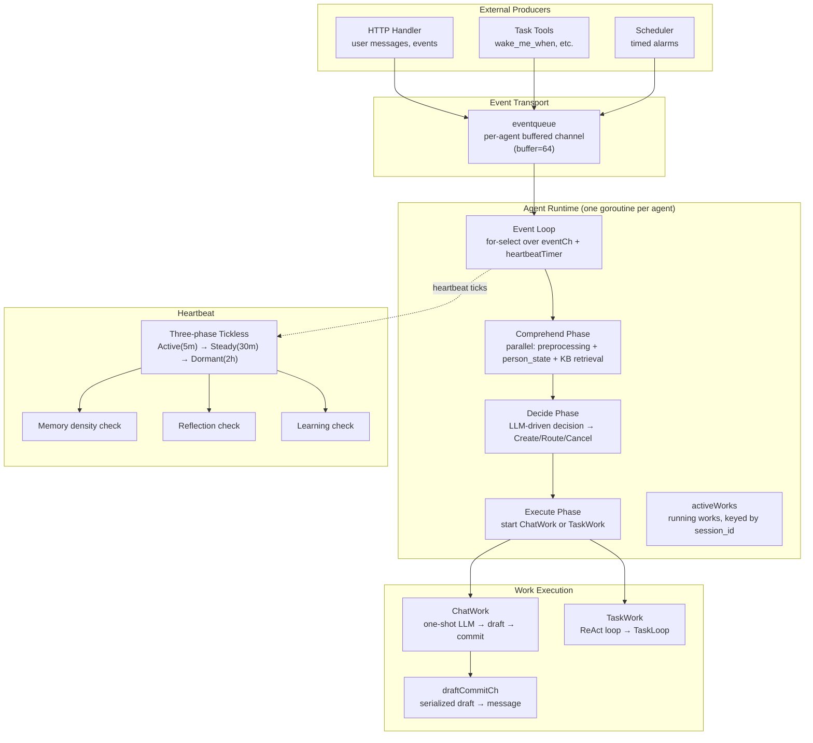

The runtime is a global singleton (`globalRuntimeManager` in manager.go). Each agent gets one `agentRuntime` with a dedicated goroutine running an event loop. The event loop processes one event at a time, serializing all agent work.

## Event Loop

The event loop is the heart of the runtime, running in a dedicated goroutine per agent:

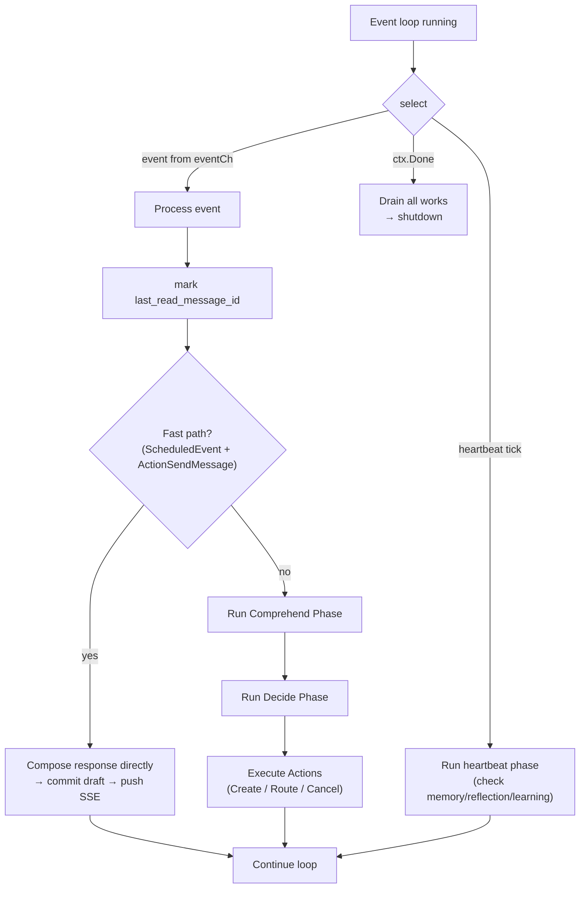

### Event handling flow

1. **Pre-processing**: Mark `last_read_message_id` on the participant session. Detect fast-path events (scheduled events with `ActionSendMessage`) that can bypass LLM entirely.

2. **Comprehend**: Runs the three-part parallel comprehension phase (preprocessing, person state inference, KB retrieval). This produces a `ComprehensionResult` with query classification, rewritten query, keywords, and retrieved segments. See [context-engineering-pipeline.md](./context-engineering-pipeline.md) for details.

3. **Decide**: The LLM receives the comprehension context and produces a `DecisionResult` with zero or more `Actions`. The decision schema is deterministic (TemperatureDeterministic) and structured via JSON Schema. See [Decision Phase](#decision-phase) below.

4. **Execute**: Each action is executed:
   - `ActionCreate`: creates a new Work (Chat or Task), adds it to `activeWorks`
   - `ActionRoute`: routes to an existing running TaskWork (via guidance channel)
   - `ActionCancel`: sends an appealable cancel directive to an existing TaskWork

### Event type routing

| Event Type | Source | Handling |
|---|---|---|
| `NewPrivateChatMessage` | User sends a message | Mark read → Comprehend → Decide → Execute |
| `WorkCompleted` | Work finishes (task loop or chat) | Remove from activeWorks → Rule-based Decide → Execute |
| `Scheduled` | Alarm fires (heartbeat + alarm goroutine) | Fast-path check → Comprehend → Rule-based Decide |
| `AlarmCreated` | `wake_me_when` tool result | AlarmRegistry registers goroutine |
| `GroupChatJoined` / `GroupChatLeft` / `SystemNotification` | System events | Direct return (no action) |

## Comprehend Phase

The Comprehend phase runs three parallel tasks to understand the incoming event context. For full details, see [context-engineering-pipeline.md](./context-engineering-pipeline.md). The phase is structured as:

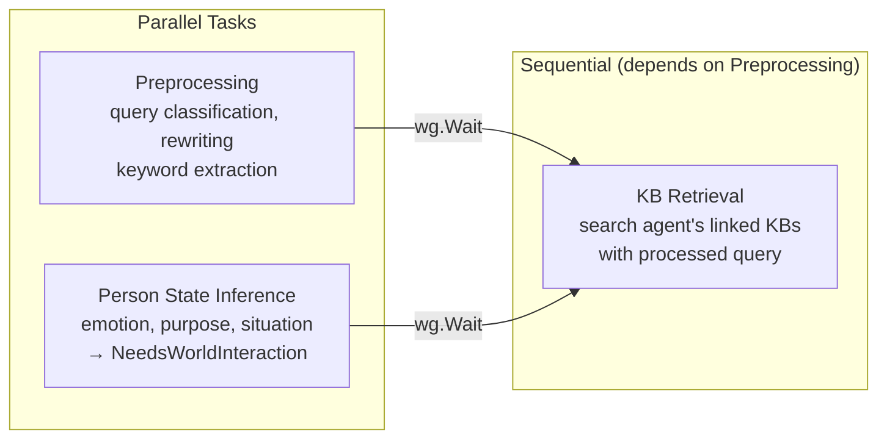

The preprocessing step classifies whether the user message contains a query (`clear`, `ambiguous`, `vague`, `no_query`), rewrites contextual queries into standalone form, and extracts keywords. Person state inference uses the last N messages to infer emotion, purpose, and situation, producing a `NeedsWorldInteraction` boolean that influences the Decide phase.

## Decide Phase

The Decide phase determines what action to take. It uses LLM-driven decision for `NewPrivateChatMessage` events, and rule-based decision for `WorkCompleted` and non-fast-path `Scheduled` events (which always trigger a ChatWork response):

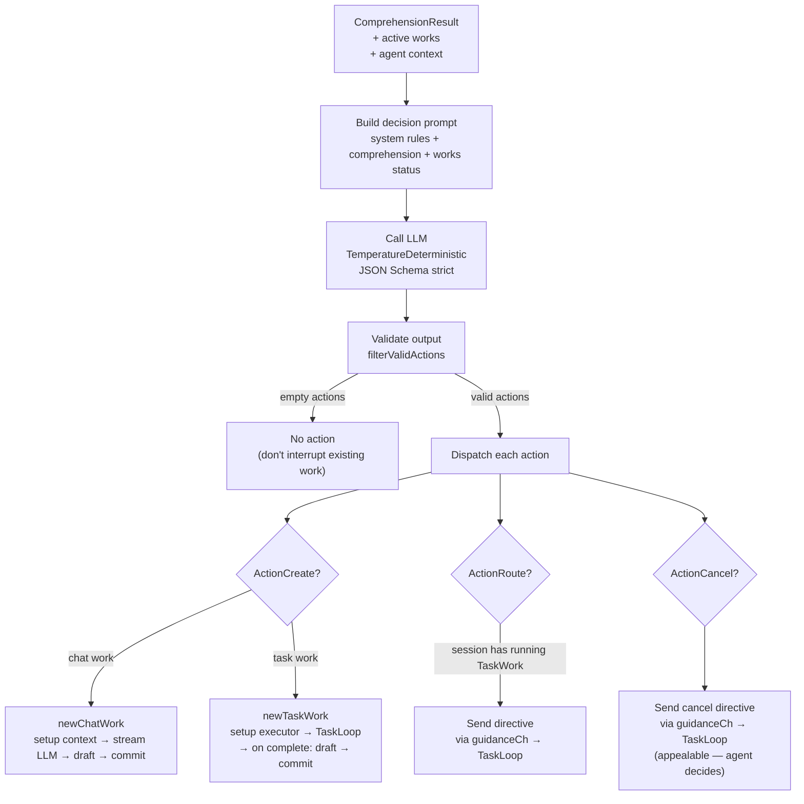

### Action types

| Action | Semantics | Implementation |
|---|---|---|
| `ActionCreate` | Start new work. Chat work for one-shot response; Task work for ReAct loop. | `newWork()` creates Work + Draft in a single transaction, then starts execution in a goroutine. |
| `ActionRoute` | Direct an existing running TaskWork toward a new objective. | Only routes to TaskWork (ChatWork has no loop to absorb the directive). Directive is sent via `guidanceCh`. |
| `ActionCancel` | Ask a running TaskWork to stop. | Appealable — not a forceful kill. Directive is sent via `guidanceCh`; the LLM decides how to wrap up. |

### Decision validation (`filterValidActions`)

The LLM output is validated defensively:
- Actions referencing non-existent or completed works are dropped
- Route/Cancel without a matching active TaskWork are dropped
- If all actions are filtered out, the agent takes no action (silent no-op, not an error)

## Work Lifecycle

Work is the unit of agent execution. There are two types:

### ChatWork

A one-shot LLM call that produces an agent response:

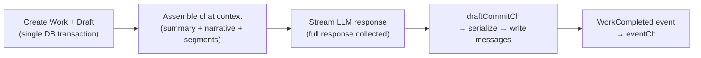

- Creates one Draft record for the response
- Uses `chat.ExecuteChat` to build context and stream the LLM
- On completion, sends the response content to `draftCommitCh` for serialized commit
- Fires `EventTypeWorkCompleted` back to the event loop

### TaskWork

A ReAct loop that runs tools to accomplish a goal:

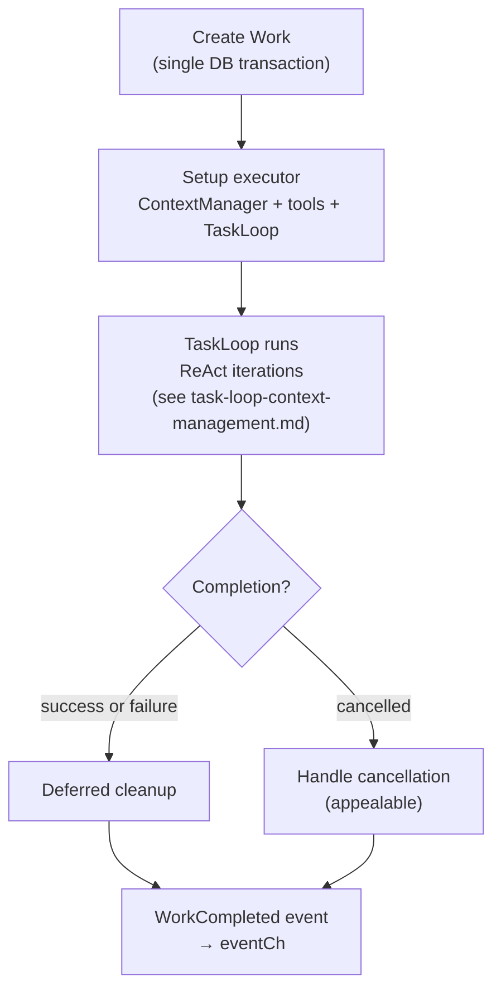

- Uses TaskLoop for ReAct execution (see [task-loop-context-management.md](./task-loop-context-management.md))
- Supports Guidance (directive injection from Decide) and Cancel (appealable, ChatWork falls back to abandon)

### Work ↔ Draft relationship

| Work Type | Draft created? | Draft committed? | Final output |
|---|---|---|---|
| ChatWork | Yes (at creation) | Yes (on completion) | Message in messages table + SSE push |
| TaskWork | **No** | — | Notes in notes.jsonl, files in workspace |

### Draft-based commit architecture

The `draftCommitCh` channel ensures serialized message commits:

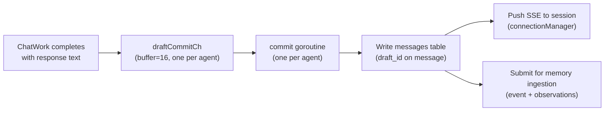

This design avoids the "placeholder message" anti-pattern (writing an empty placeholder, then updating it), and guarantees that messages across multiple concurrent ChatWorks are written in a predictable order.

### Active works management

- `activeWorks` is a slice of running works; works are identified by ID via `findActiveWorkByID`
- `hasActiveWorkInSession(sessionID)` checks whether any active work targets the given session
- Works are removed from `activeWorks` when their `WorkCompleted` event is processed

## Heartbeat System

The heartbeat mimics Linux's tickless kernel — the interval elongates as the agent becomes idle:

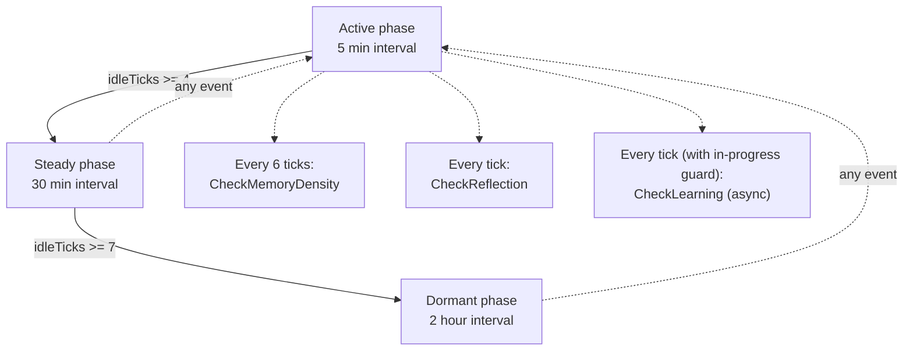

### Heartbeat checks

| Check | Frequency | What it does |
|---|---|---|
| `checkMemoryDensity` | Every 6 ticks | Calls `memory.CheckProfileDensity()` to trigger EntityProfile generation when observation density crosses threshold |
| `checkReflection` | Every tick | Calls `experience.CheckReflection()` to scan notes.jsonl for new insights |
| `checkLearning` | Every tick (with in-progress guard) | Calls `experience.CheckLearning()` to discover public experiences worth adopting |

The check functions are lightweight — they enqueue work asynchronously and return immediately. The heartbeat tick itself is fast, ensuring the event loop is never blocked by long-running reflection.

## Alarm System

Alarms implement the `wake_me_when` tool contract — the agent asks to be woken at a specific time:

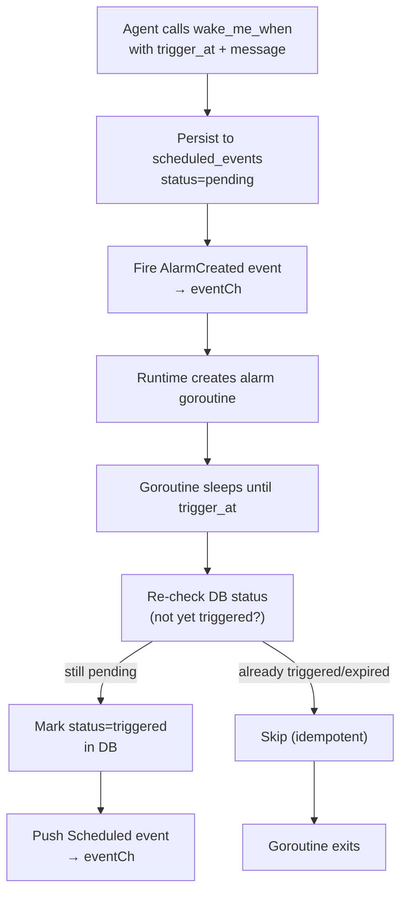

- Each alarm is a goroutine tracked in `alarmRegistry` keyed by `scheduledEventID`
- On runtime restart, `recoverOrphanAlarms` restores all pending alarms
- The goroutine uses `time.Until(triggerAT)` to sleep, then double-checks DB status before firing (prevents duplicate fires after restart + crash)

## Startup & Recovery

On application startup, the runtime manager performs recovery before starting agent goroutines:

1. **Reset participant sessions**: all AI `participant_sessions` with `status=working` are reset to `idle` (crashed while working)
2. **Recover active works**: `recoverActiveWorks` marks running works as `Abandoned`, discards their drafts, resets participant status
3. **Start agent runtimes**: one `agentRuntime` per `agent_config`
4. **Recover scheduled events**: `recoverScheduledEvents` restores all `scheduled_events` with `status=pending` and `trigger_at` in the future

### Work recovery

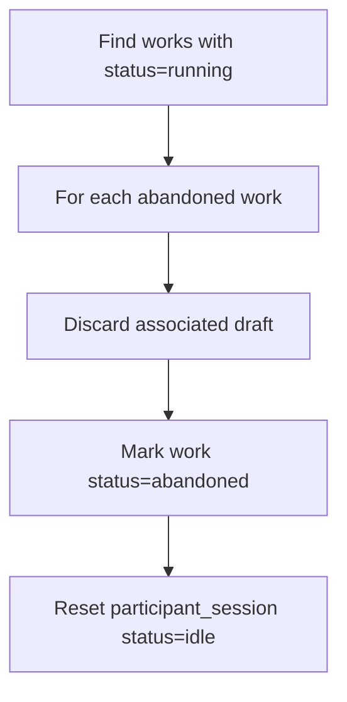

Works are not resumable after a crash. The design assumes:
- ChatWorks produce ephemeral responses (a new response is generated on next user message)
- TaskWorks leave their state in notes.jsonl and workspace files (the agent re-reads notes on next task)

## Configuration

| Config | Description | Relationship |
|---|---|---|
| `HeartbeatActiveInterval` | Tick interval when agent recently had events | Default 5 min |
| `HeartbeatSteadyAfter` | Consecutive empty ticks to enter steady phase | Default 3 |
| `HeartbeatSteadyInterval` | Tick interval in steady phase | Default 30 min |
| `HeartbeatDormantAfter` | Additional empty ticks to enter dormant phase | Default 6 |
| `HeartbeatDormantInterval` | Tick interval in dormant phase | Default 2 h |

## Shutdown

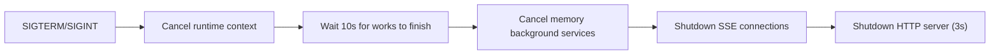

The 10-second grace period allows in-progress ChatWorks and TaskWorks to reach a natural stopping point. Works that don't finish in time are abandoned (state persists in DB for next startup recovery).
