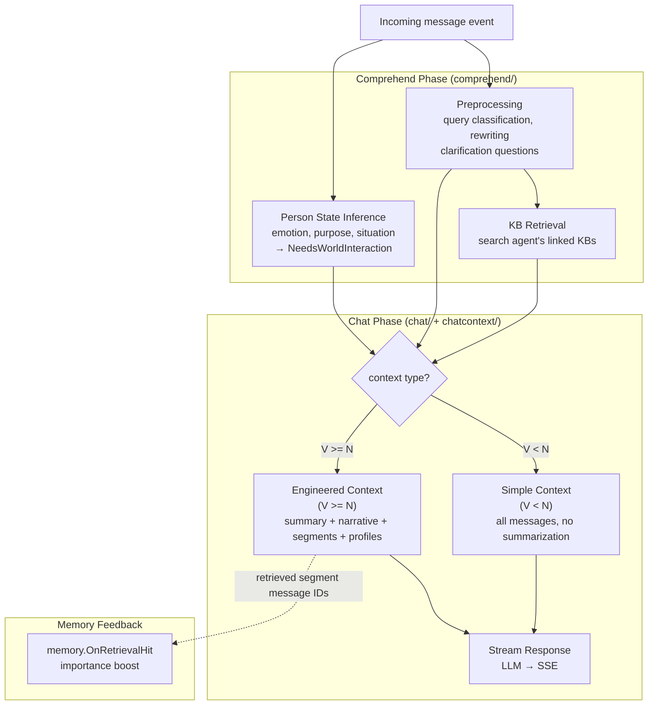
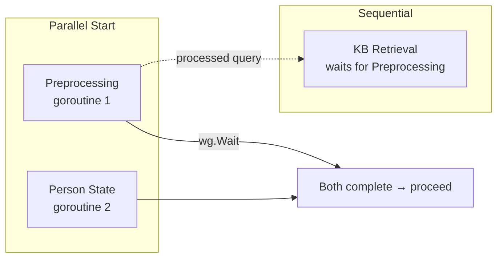
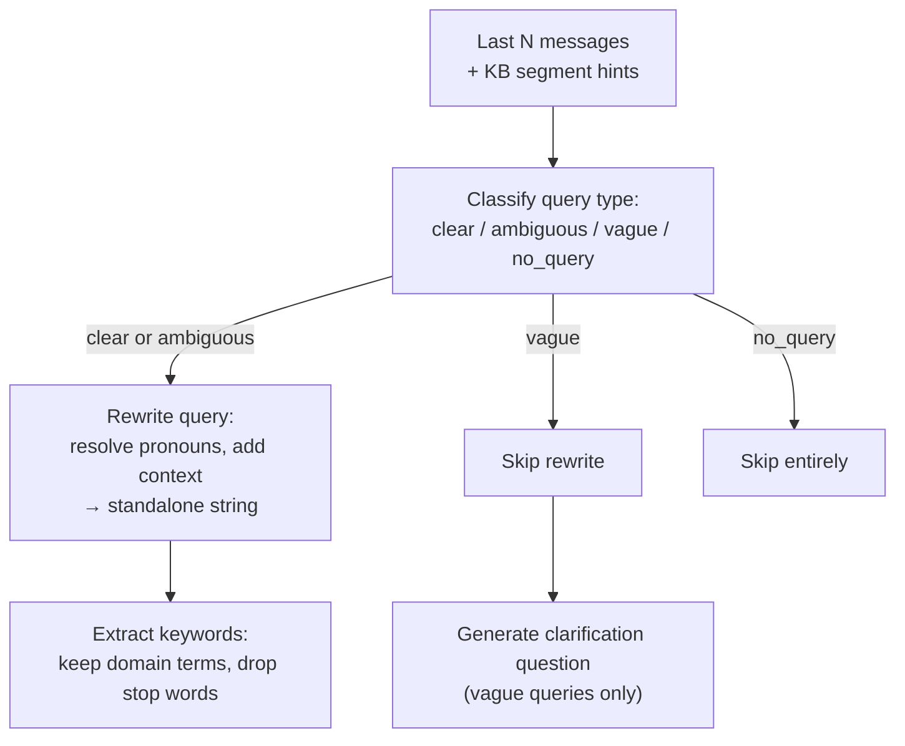
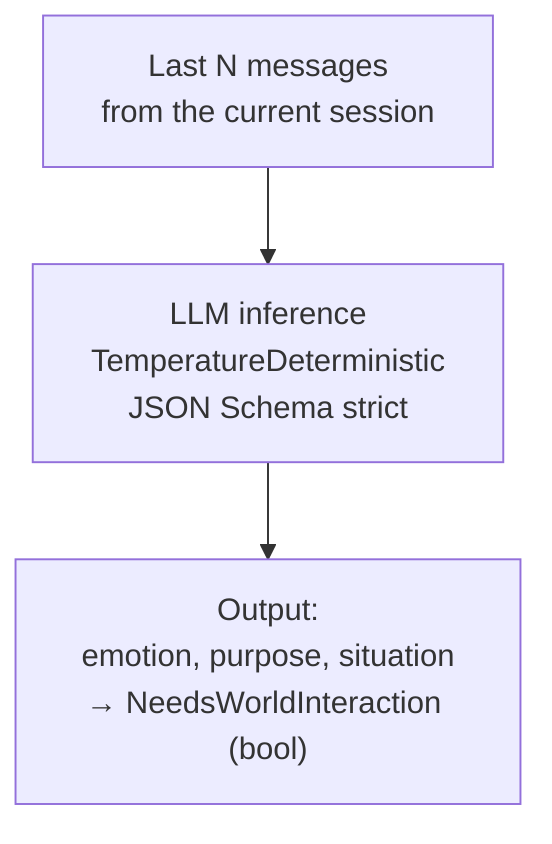
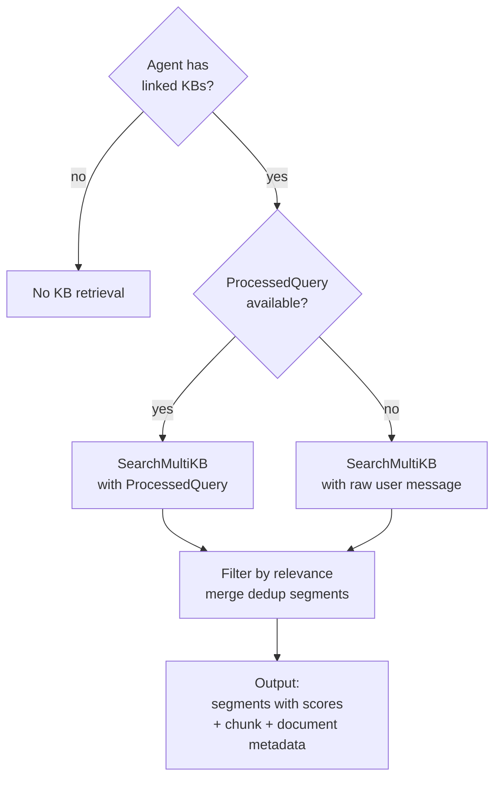
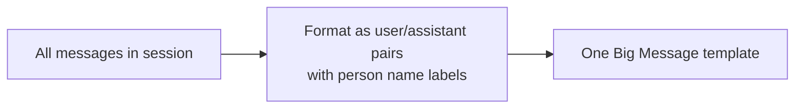
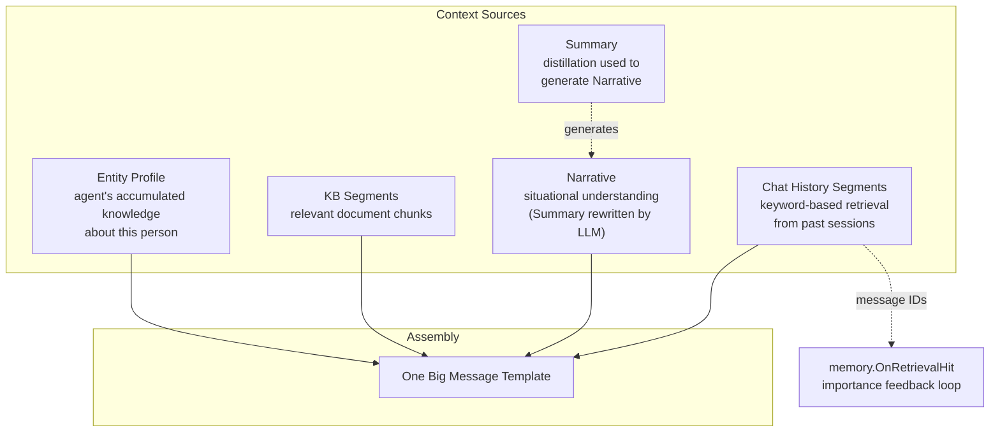
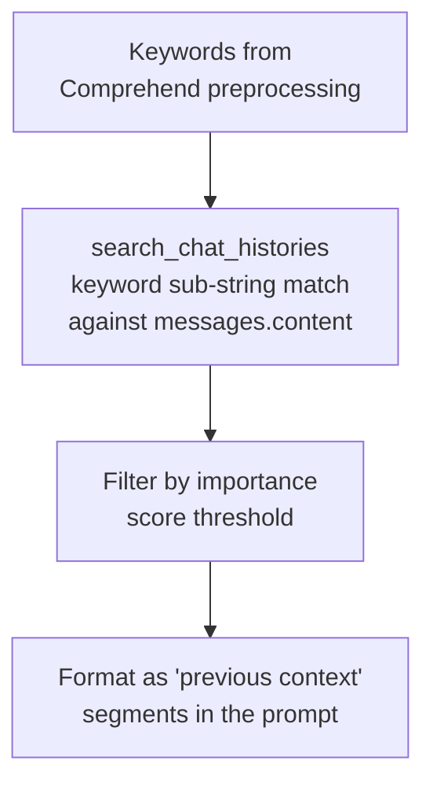
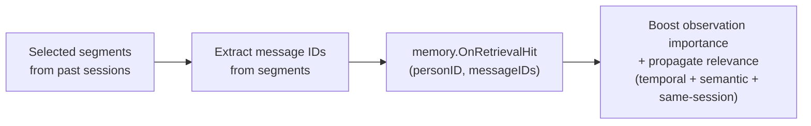

# Context Engineering Pipeline — Engineering Implementation

This document describes how the chat context is assembled for LLM consumption. It covers the Comprehend phase (understanding the user input), the Chat phase (assembling the prompt context), and how they interoperate.

## Architecture Overview



The pipeline has two phases: Comprehend (run before Decide) produces understanding, and Chat (run by ChatWork) consumes that understanding to build the LLM prompt.

## Comprehend Phase

The Comprehend phase runs in the event loop before Decide. It has two parallel sub-tasks (Preprocessing runs concurrently with PersonState), with KB Retrieval following Preprocessing sequentially:



### 1. Preprocessing

The preprocessing step classifies and rewrites the user's query for downstream use:



The output:
- `ProcessedQuery`: the rewritten, standalone query string (for KB search)
- `Keywords`: extracted domain terms (for chat-history keyword search)
- `ClarificationQuestion`: a question to ask the user when the query is unclear

The preprocessing is skipped entirely when no KB is configured on the agent AND the message count is below the window size threshold — it's an optimization that avoids unnecessary LLM calls.

### 2. Person State Inference

Runs independently to infer the other person's current state:



- Temperature is deterministic (0) because this is a classification task, not creative generation
- `NeedsWorldInteraction` is the key signal: when the user is asking for help, making plans, expressing needs — this boolean is `true` and influences the Decide phase toward creating a TaskWork
- When the user is just chatting, sharing feelings, or making small talk, `NeedsWorldInteraction` is false and the agent stays in chat mode

### 3. KB Retrieval

Searches the agent's linked KBs for relevant context:



Uses `SearchMultiKB` to search across all linked KBs concurrently. Each search produces top-K results; results from all KBs are merged and sorted by relevance.

## Chat Phase — Two Branches

The chat phase chooses between two context assembly strategies based on message volume:

```
if message_count < window_size:
    → Simple Context (direct dump, no summarization)
else:
    → Engineered Context (summary + narrative + retrieval + profiles)
```

This bifurcation exists because:
- **Simple**: When the conversation is short, all messages fit in the context window. Summarization would add latency without benefit.
- **Engineered**: When the conversation is long, directly dumping all messages would overflow the context window. Engineered context distills the essential information.

### Simple Context (`V < N`)



- All messages are included verbatim
- Person name labels distinguish speakers in multi-agent sessions
- No summarization, no narrative, no retrieval — just the raw conversation

### Engineered Context (`V >= N`)



#### Summary

Generated periodically when the conversation exceeds the window. The LLM distills key topics, decisions, and context from messages beyond the visible window. The raw summary text is not injected directly into the prompt — instead, it is rewritten by the LLM into a first-person "Narrative" (below), which is what actually appears in the context.

#### Chat History Retrieval

Keyword-based retrieval from the agent's past interactions:



- Uses the keywords extracted during preprocessing (not the full query)
- Performs case-insensitive sub-string matching against `messages.content` in past sessions
- After segments are selected, calls `memory.OnRetrievalHit()` with the segment message IDs — this feeds the importance boost back into the memory system for relevance propagation

#### Narrative

When the message count exceeds the window size threshold, the comprehension summary is injected into the chat context as a "narrative" paragraph — describing what the agent knows about the conversation so far. This bridges the gap between older conversation history and the current visible messages.

#### Entity Profiles

The agent's accumulated EntityProfile for the current user (from `memory.LoadProfileForEntity`) is injected as a short paragraph:

```
Your impression of {user_name}:
{narrative}
```

This gives the LLM personalized context without needing to re-derive it from raw messages.

### One Big Message Template

All dynamic context (whether simple or engineered) is packed into a **single user message** sent to the LLM:

```
## Context
{Summary section (if engineered)}
{Narrative section (if engineered)}
{Chat History section (if engineered)}
{KB Results section (if engineered)}
{Entity Profile section (if engineered)}

{User's Message}
**{sender_name}**: {content}
```

## Trigger Override

When the event source is a scheduled alarm (the agent's own `wake_me_when`), the user message is rewritten:

```
Original alarm text: "Remind me to check the report at 3pm"
At trigger time → "[ALARM NOTIFICATION] An alarm you set has just triggered. This is NOT a new request — you set this alarm yourself earlier. Take action now based on your self-reminder below.

Your self-reminder: {alarm message text}

[Original message for reference: {original alarm text}]"
```

This prevents the LLM from misinterpreting the trigger as a new user request — it frames it as "you asked to be reminded of this, here it is."

## Memory Feedback Loop

When the Chat History Retrieval step finds relevant past segments, it triggers the memory feedback loop:



This creates a closed loop: the more a past event is retrieved and used in context, the more important it becomes, and the more likely it is to be retrieved again in the future. Combined with daily decay, this implements a natural "use it or lose it" memory model.

## Configuration

| Config | Description | Default |
|---|---|---|
| `MessageWindow` (N) | Threshold for switching from Simple to Engineered context | Configurable via agent config |
| `SegmentsTopK` | Number of chat history segments to retrieve | Configurable via agent config |
| `KBTopK` | Number of KB segments to include | 5 |
| `EntityProfileThreshold` | Minimum observations for profile generation | 10 |

## Key Design Decisions

1. **Preprocessing is separate from Comprehend but reuses its output in Chat**: The Chat phase receives the full `ComprehensionResult` and can skip its own preprocessing/retrieval if the params match — avoiding duplicate LLM calls.

2. **Narrative is separate from Summary**: Summary is about what happened (factual), Narrative is about what the agent knows and is doing (contextual). They serve different purposes and are composed independently.

3. **Entity Profiles as prose, not JSON**: Profiles are stored as narrative paragraphs and injected as markdown text. This is simpler for the LLM to consume than structured JSON and more natural in the prompt flow.

4. **No distinct `chat` vs `task` context engines**: The same `chat.ExecuteChat` function handles both use cases. When called from a TaskWork's deferred cleanup, the narrative section is populated with the task's final summary.

5. **Memory Feedback is fire-and-forget**: The `OnRetrievalHit` call does not block the chat pipeline. It launches background goroutines for relevance propagation and returns immediately.
