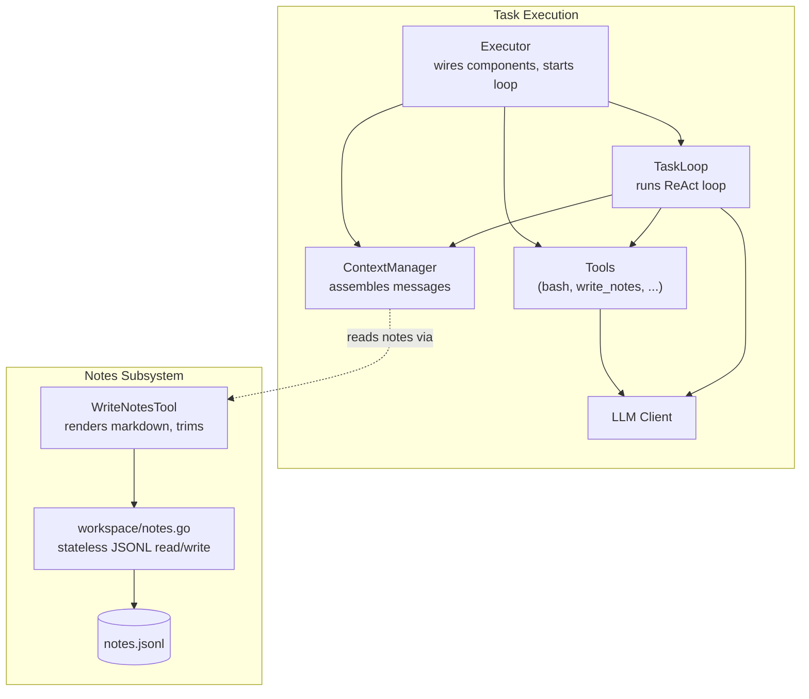
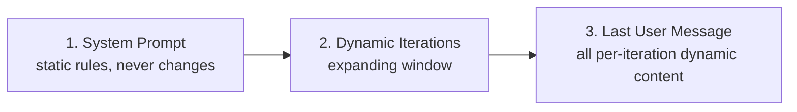
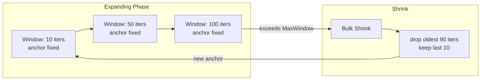
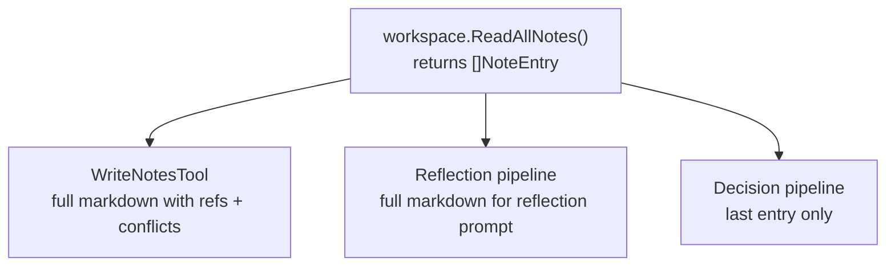
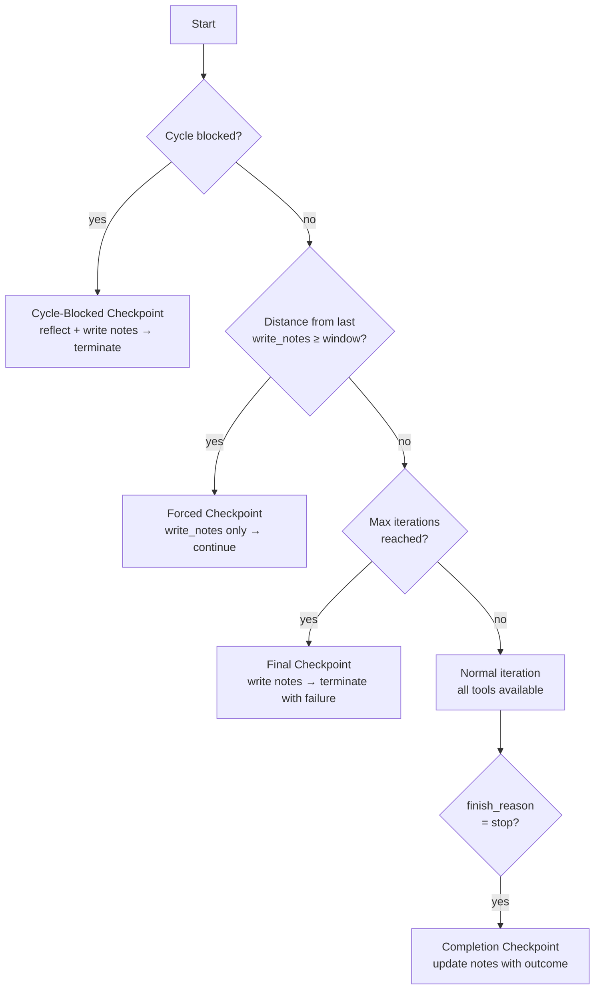
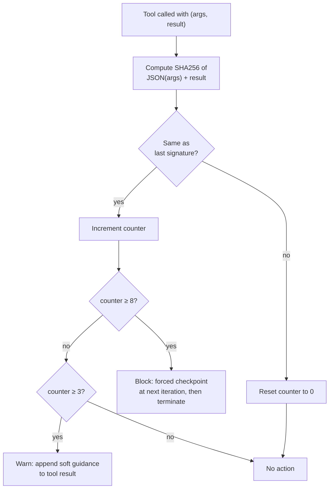
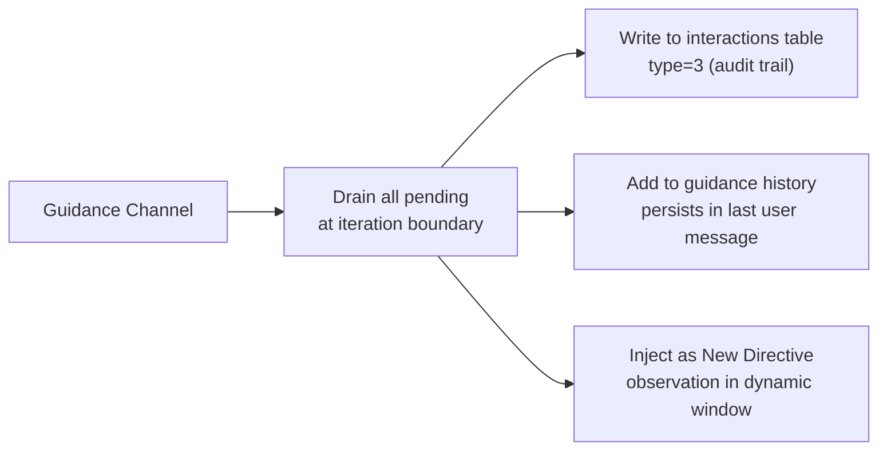
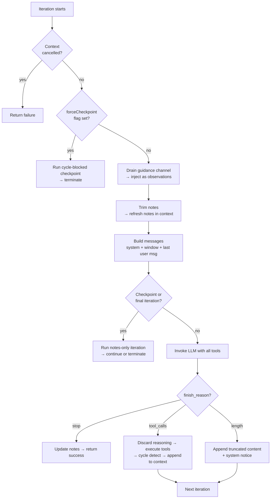

# Task Loop Context Management — Engineering Implementation

This document describes how the task loop's context management is implemented in the current codebase. It covers message assembly, the expanding window, notes storage, checkpoints, cycle detection, and guidance injection. For the theoretical foundation, see [task-execution-and-reader-oriented-memory.md](../task-execution-and-reader-oriented-memory.md).

## Architecture Overview

The Executor builds the ContextManager, tool list, and TaskLoop once at task start. The TaskLoop then runs autonomously, calling the LLM and executing tools each iteration. The ContextManager controls what the LLM sees; the WriteNotesTool bridges between the LLM (via tool calls) and the storage layer (via stateless functions keyed by person ID + session ID).

## Message Assembly

The ContextManager assembles the message list sent to the LLM on each iteration. The structure has three parts, ordered for LLM prefix caching:

**Part 1 — System prompt**: Built once at task start. Contains background context, metadata, workspace rules, and the NOTES Usage Guide. Never changes between iterations, so it always hits the prefix cache.

**Part 2 — Dynamic iterations**: Each iteration produces a group of one assistant message plus N tool result messages. These groups are the atomic unit of the window — always included or excluded together. Between bulk shrinks, only one new group is appended per iteration, so all previous groups hit the prefix cache.

**Part 3 — Last user message**: All per-iteration dynamic content is packed into a single trailing user message. This includes:

- **Directive History** — accumulated guidance changes with timestamps, never dropped by the window
- **Context Information** — workspace paths, OS, iteration stats, notes size
- **Tool List** — formatted tool names and descriptions
- **Your Notes** — full notes content rendered as markdown

Packing all dynamic content at the tail means it cannot break the cached prefix of parts 1 and 2.

## Expanding Window with Bulk Shrink

The dynamic iterations use an expanding window with bulk-shrink, not a fixed sliding window. This design maximizes prefix cache hits: between shrinks, the only change is one new iteration appended at the end.

Two config values control the window:

| Config | Default | Role |
|--------|---------|------|
| `MinIterationWindow` | 10 | Anchor size after a shrink (also checkpoint frequency) |
| `MaxIterationWindow` | 100 | Triggers a shrink when exceeded |

**Expanding phase**: New iterations append to the end. The anchor (oldest visible iteration) stays fixed. Between shrinks, only the last iteration changes — maximizing prefix cache hits.

**Bulk shrink**: When the window exceeds `MaxIterationWindow`, the oldest iterations are dropped in bulk down to `MinIterationWindow`. This forms a new anchor that stays fixed for the next expansion cycle.

The agent is told exactly how much it cannot see via the Context Information section, which includes the total iteration count, visible count, and invisible count. This makes the statelessness boundary explicit rather than hidden.

## Notes Subsystem

### Storage

Notes are stored as JSONL in the session workspace's `.meta/` directory. The storage layer provides stateless, package-level functions keyed by `(personID, sessionID)` — no file paths leak to callers. The API supports append, read-all, read-last, rewrite, and fingerprint (SHA256 of raw file content for change detection).

Each entry is one JSONL line containing a timestamp (RFC3339), type (int enum), content, optional references (file paths), and optional conflicts_with marker. The type field uses int values (1=observation, 2=decision, 3=finding, 4=correction, 5=progress) per project rules. The LLM tool schema exposes string enums; conversion happens at the tool boundary.

### Rendering

The storage layer does not format. Each caller renders notes independently for its own needs:

- **WriteNotesTool** renders entries as markdown with timestamp headers, references, and conflict markers for LLM consumption in the context window
- **Reflection pipeline** renders entries with its own markdown format for the reflection LLM prompt
- **Decision pipeline** renders only the last entry as "Latest progress" for the Decide LLM — a single notes entry is naturally bounded in size

### Trimming

When rendered notes exceed `NotesMaxChars` (default: 10000), the WriteNotesTool removes oldest entries one by one until under the limit, then rewrites the file. A trim marker is prepended to the rendered output so the agent knows context is incomplete.

The agent is warned when approaching the limit (at 80% of `NotesMaxChars`), encouraging consolidation before forced trimming occurs.

## Checkpoints

The checkpoint mechanism ensures the agent externalizes its state at regular intervals. There are three types:

**Forced checkpoint** — Triggered when the distance from the last `write_notes` call reaches `MinIterationWindow`. Only `write_notes` is available; all other tools are removed. After the agent writes notes, `lastNotesIter` is updated and all tools are restored. Normal execution continues. This respects agent autonomy (it can write voluntarily) while ensuring memory persistence at regular intervals.

**Final checkpoint** — When `maxIterations` is reached without completion, a final checkpoint runs with a prompt indicating the task could not be completed. The work terminates with failure after notes are saved, leaving a continuation point for the next execution.

**Completion checkpoint** — When the LLM returns `finish_reason=stop`, one more LLM call runs with only `write_notes` available, asking the agent to record the final outcome. This ensures notes reflect the final state for future modifications.

### Checkpoint vs. Window Shrink — Independence

Checkpoint and bulk shrink are independent mechanisms that serve different purposes:

| Mechanism | Controls | Threshold | Effect |
|-----------|----------|-----------|--------|
| Checkpoint | Notes write frequency | `MinIterationWindow` (default 10) | Resets `lastNotesIter`; does NOT touch the visible iterations |
| Bulk shrink | Iteration visibility | `MaxIterationWindow` (default 100) | Drops oldest iterations down to `MinIterationWindow`; does NOT trigger notes write |

The checkpoint threshold (`MinIterationWindow`) is shared with the post-shrink anchor size — but this is the only overlap. Writing notes does not shrink the window, and a window shrink does not trigger a checkpoint. They operate on separate concerns:

- **Checkpoint** ensures the agent persists reasoning to notes before old iterations scroll out of view
- **Bulk shrink** controls how many iterations the LLM can see, optimizing for prefix cache

A voluntary `write_notes` call (outside of checkpoint) also only resets the `lastNotesIter` counter — it does not affect the dynamic window contents. The visible iterations are solely determined by the expanding/bulk-shrink cycle in `BuildMessages`.

## Cycle Detection

Each tool embeds a `CycleDetector` that tracks whether the `(args, result)` pair is identical to the previous call. The detector does not interpret content, parse JSON, or judge whether a result is an error — it only checks whether the same input produced the same output repeatedly.

### Two-Phase Response

**Warn (3 consecutive)** — A soft nudge is appended to the tool result, asking the agent to self-reflect: "Is repeating this making progress? Could a different approach work? Perhaps the root cause is elsewhere." The agent retains all tools and can continue.

**Block (8 consecutive)** — A forced checkpoint is triggered at the next iteration boundary. Only `write_notes` is available; the agent is asked to reflect on why the cycle occurred and record findings. After notes are saved, the work terminates with failure. Block does not return an error — returning an error would make the LLM try to "fix" the error by retrying, which is counterproductive.

### Per-Work Lifecycle

Tool instances are created per work, so each `CycleDetector` starts with a fresh state. The detector's state naturally follows the work's lifecycle — no explicit reset is needed.

## Guidance Injection

New directives can arrive during execution via a channel. At each iteration boundary, the TaskLoop drains all pending guidance and injects each as an environment event in the ReAct cycle:

This models guidance as something that happens in the agent's environment — the agent must observe it, reason about its impact, and act accordingly. The directive is recorded in three places for full traceability: the database (audit), the guidance history (persists across all iterations, never dropped by the window), and the dynamic window (visible as an observation in the ReAct cycle).

## Tool Output Management

Tool results pass through two layers of size control:

1. **Semantic truncation** — Each tool is responsible for truncating its own output before returning. Tools keep only the most relevant portion (e.g., bash keeps stderr + line count rather than full stdout). This is the primary control mechanism.

2. **Byte-level fallback** — If a tool's output exceeds 50KB (a safety net for tools that forgot to self-truncate), the content is discarded and replaced with a notice telling the agent to use a more targeted command.

Additionally, when the LLM returns tool calls accompanied by reasoning content, the reasoning is discarded before the assistant message is added to the context. Only tool calls and their results are carried forward. This prevents internal reasoning from leaking into the final user-facing response via the chat layer.

## Iteration Lifecycle

Each iteration follows this lifecycle: check for cancellation, check for cycle-blocked state, drain guidance, refresh notes, build messages, check for checkpoint conditions, invoke the LLM, and branch on the finish reason. Tool calls are executed, cycle-detected, and appended to the context for the next iteration.

## Configuration

| Config | Env var | Default | Description |
|--------|---------|---------|-------------|
| TaskMaxIterations | `TASK_MAX_ITERATIONS` | 300 | Hard limit on loop iterations |
| MinIterationWindow | `MIN_ITERATION_WINDOW` | 10 | Visible iterations after shrink; also checkpoint frequency |
| MaxIterationWindow | `MAX_ITERATION_WINDOW` | 100 | Triggers bulk shrink when exceeded |
| NotesMaxChars | `NOTES_MAX_CHARS` | 10000 | Character limit for rendered notes |

## Interaction Records

Every iteration is recorded to the `interactions` table for audit and debugging, grouped by `(session_id, work_id, iteration)`:

| Type | When recorded | Content |
|------|-------------|---------|
| Request (1) | Before LLM call | Messages sent to the LLM |
| Response (2) | After LLM call | Content, tool calls, finish reason |
| Guidance (3) | When guidance arrives | Guidance directive + reason |

These records support both frontend display (showing the agent's step-by-step process) and post-hoc debugging (reconstructing what happened in a failed task).
